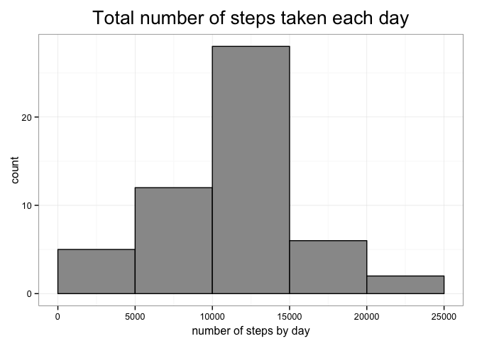
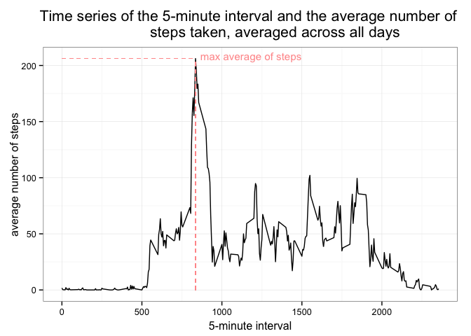
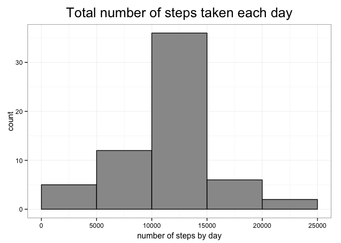
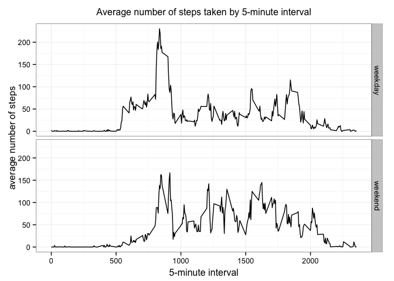

# Reproducible Research: Peer Assessment 1


## Loading and preprocessing the data
> Show any code that is needed to  
  1. Load the data (i.e. read.csv())  
  2. Process/transform the data (if necessary) into a format suitable for your analysis

First, we load the needed libraries.

```r
library(dplyr)
library(lubridate)
library(grid)
library(ggplot2)
```

We import directly the data from the zipped version.

```r
dat <- read.csv(unz("activity.zip", "activity.csv"), header = TRUE)
```

Then, we check some metrics to discover the dataset.

```r
str(dat)
```

```
## 'data.frame':	17568 obs. of  3 variables:
##  $ steps   : int  NA NA NA NA NA NA NA NA NA NA ...
##  $ date    : Factor w/ 61 levels "2012-10-01","2012-10-02",..: 1 1 1 1 1 1 1 1 1 1 ...
##  $ interval: int  0 5 10 15 20 25 30 35 40 45 ...
```

```r
summary(dat)
```

```
##      steps                date          interval     
##  Min.   :  0.00   2012-10-01:  288   Min.   :   0.0  
##  1st Qu.:  0.00   2012-10-02:  288   1st Qu.: 588.8  
##  Median :  0.00   2012-10-03:  288   Median :1177.5  
##  Mean   : 37.38   2012-10-04:  288   Mean   :1177.5  
##  3rd Qu.: 12.00   2012-10-05:  288   3rd Qu.:1766.2  
##  Max.   :806.00   2012-10-06:  288   Max.   :2355.0  
##  NA's   :2304     (Other)   :15840
```

```r
head(dat)
```

```
##   steps       date interval
## 1    NA 2012-10-01        0
## 2    NA 2012-10-01        5
## 3    NA 2012-10-01       10
## 4    NA 2012-10-01       15
## 5    NA 2012-10-01       20
## 6    NA 2012-10-01       25
```

```r
tail(dat)
```

```
##       steps       date interval
## 17563    NA 2012-11-30     2330
## 17564    NA 2012-11-30     2335
## 17565    NA 2012-11-30     2340
## 17566    NA 2012-11-30     2345
## 17567    NA 2012-11-30     2350
## 17568    NA 2012-11-30     2355
```

```r
colSums(is.na(dat))
```

```
##    steps     date interval 
##     2304        0        0
```

It seems that the date variable is a factor, so we use the lubridate package to
convert the date into a POSIXct class.

```r
dat <- mutate(dat, date = ymd(date))
```

We check that the transformation has gone well.

```r
class(dat$date)
```

```
## [1] "POSIXct" "POSIXt"
```

```r
summary(dat$date)
```

```
##         Min.      1st Qu.       Median         Mean      3rd Qu. 
## "2012-10-01" "2012-10-16" "2012-10-31" "2012-10-31" "2012-11-15" 
##         Max. 
## "2012-11-30"
```

```r
head(dat)
```

```
##   steps       date interval
## 1    NA 2012-10-01        0
## 2    NA 2012-10-01        5
## 3    NA 2012-10-01       10
## 4    NA 2012-10-01       15
## 5    NA 2012-10-01       20
## 6    NA 2012-10-01       25
```

## What is mean total number of steps taken per day?
> For this part of the assignment, you can ignore the missing values in the 
dataset.  
  1. Calculate the total number of steps taken per day  
  2. If you do not understand the difference between a histogram and a barplot, 
research the difference between them. Make a histogram of the total number of 
steps taken each day  
  3. Calculate and report the mean and median of the total number of steps taken 
per day

**For this part, we'll ignore the missing values in the dataset.**  

First, we calculate the total number of steps taken per day.

```r
dat2 <- dat %>%
    filter(!is.na(steps)) %>%
    group_by(date) %>% summarise(total = sum(steps))

head(dat2, 10)
```

```
## Source: local data frame [10 x 2]
## 
##          date total
##        (time) (int)
## 1  2012-10-02   126
## 2  2012-10-03 11352
## 3  2012-10-04 12116
## 4  2012-10-05 13294
## 5  2012-10-06 15420
## 6  2012-10-07 11015
## 7  2012-10-09 12811
## 8  2012-10-10  9900
## 9  2012-10-11 10304
## 10 2012-10-12 17382
```

Then we make a histogram of the values.

```r
h1 <- ggplot(dat2, aes(x =  total)) +
    geom_histogram(binwidth = 5000, col = "black", fill = "#999999") +
    xlab("number of steps by day") +
    ggtitle("Total number of steps taken each day") +
    xlim(0, 25000) +
    theme_bw() +
    theme(
        axis.title.x = element_text(vjust = 0),
        plot.title = element_text(
            size = 20,
            vjust = 1.5
          )
        ) 
h1
```

 

We calculate the mean and median:

```r
mean(dat2$total)
```

```
## [1] 10766.19
```

```r
median(dat2$total)
```

```
## [1] 10765
```

## What is the average daily activity pattern?
>  
  1. Make a time series plot (i.e. type = "l") of the 5-minute interval 
(x-axis) and the average number of steps taken, averaged across all days 
(y-axis)  
  2. Which 5-minute interval, on average across all the days in the dataset, 
contains the maximum number of steps?  

First, we need to group the steps by the "interval" variable.

```r
dat3 <- dat %>% 
    group_by(interval) %>% 
    summarise(total = mean(steps, na.rm = TRUE))
head(dat3)
```

```
## Source: local data frame [6 x 2]
## 
##   interval     total
##      (int)     (dbl)
## 1        0 1.7169811
## 2        5 0.3396226
## 3       10 0.1320755
## 4       15 0.1509434
## 5       20 0.0754717
## 6       25 2.0943396
```


```r
p <- ggplot(dat3, aes(x = interval, y = total)) + 
    geom_line() +
    xlab("5-minute interval") +
    ylab("average number of steps") +
    ggtitle("Time series of the 5-minute interval and the average number of 
            steps taken, averaged across all days") +
    theme_bw() +
    theme(
        axis.title.x = element_text(vjust = 0),
        plot.title = element_text(
            size = 16,
            vjust = 1.5
          )
        ) +
    geom_segment(aes(x = 0, y = 206.1698, xend = 835, yend = 206.1698), 
                 color = "#FF9999", linetype="dashed", size = .2) +
    geom_segment(aes(x = 835, y = 0, xend = 835, yend = 206.1698), 
                 color = "#FF9999", linetype="dashed", size = .2) +
    annotate("text", x = 865, y = 205, label = "max average of steps", size = 4,
             color = "#FF9999", hjust = 0, vjust = 0)
p
```

 

Now we search for the maximum number of steps, using the top_n() function from 
the dplyr package:

```r
dat3 %>% top_n(1, total)
```

```
## Source: local data frame [1 x 2]
## 
##   interval    total
##      (int)    (dbl)
## 1      835 206.1698
```
**Answer**: The interval **835** has the maximum average number of steps.

## Imputing missing values
> Note that there are a number of days/intervals where there are missing values 
(coded as NA). The presence of missing days may introduce bias into some 
calculations or summaries of the data.  
  1. Calculate and report the total number of missing values in the dataset (i.e. 
the total number of rows with NAs)  
  2. Devise a strategy for filling in all of the missing values in the dataset. 
The strategy does not need to be sophisticated. For example, you could use the 
mean/median for that day, or the mean for that 5-minute interval, etc.  
  3. Create a new dataset that is equal to the original dataset but with the 
missing data filled in.  
  4. Make a histogram of the total number of steps taken each day and Calculate 
and report the mean and median total number of steps taken per day. Do these 
values differ from the estimates from the first part of the assignment? What is 
the impact of imputing missing data on the estimates of the total daily number 
of steps?

Total number of missing values in the dataset:

```r
colSums(is.na(dat))
```

```
##    steps     date interval 
##     2304        0        0
```

### Strategy for filling in all of the missing values
Let's check first if some days have completely NAs for the "steps" column:

```r
dat %>% group_by(date) %>% filter(is.na(steps)) %>% count(date)
```

```
## Source: local data frame [8 x 2]
## 
##         date     n
##       (time) (int)
## 1 2012-10-01   288
## 2 2012-10-08   288
## 3 2012-11-01   288
## 4 2012-11-04   288
## 5 2012-11-09   288
## 6 2012-11-10   288
## 7 2012-11-14   288
## 8 2012-11-30   288
```

There are 8 days without any value for "steps". Given that, it's preferrable to 
replace the missing values by the **mean of the 5-minute interval**. We round 
the decimal values to a whole number using the round() function.

We create a new dataset that is equal to the original one but with the missing 
data filled in.

```r
dat4 <- dat %>% 
  group_by(interval) %>% 
  mutate(steps = ifelse(is.na(steps), round(mean(steps, na.rm = TRUE)), steps))
```

Let's check if there are no more NAs:

```r
colSums(is.na(dat4))
```

```
##    steps     date interval 
##        0        0        0
```
and if there are still days without any "steps" value:

```r
dat4 %>% group_by(date) %>% filter(is.na(steps)) %>% count(date)
```

```
## Source: local data frame [0 x 2]
## 
## Variables not shown: date (time), n (int)
```

With this new dataset, we make the same histogram as previously, showing the 
total number of steps taken each day.

We do the same task of grouping the data by date:

```r
dat5 <- dat4 %>%
    group_by(date) %>% summarise(total = sum(steps))

head(dat5, 10)
```

```
## Source: local data frame [10 x 2]
## 
##          date total
##        (time) (dbl)
## 1  2012-10-01 10762
## 2  2012-10-02   126
## 3  2012-10-03 11352
## 4  2012-10-04 12116
## 5  2012-10-05 13294
## 6  2012-10-06 15420
## 7  2012-10-07 11015
## 8  2012-10-08 10762
## 9  2012-10-09 12811
## 10 2012-10-10  9900
```

And then we make the graph:

```r
h2 <- ggplot(dat5, aes(x =  total)) +
    geom_histogram(binwidth = 5000, col = "black", fill = "#999999") +
    xlab("number of steps by day") +
    ggtitle("Total number of steps taken each day") +
    xlim(0, 25000) +
    theme_bw() +
    theme(
        axis.title.x = element_text(vjust = 0),
        plot.title = element_text(
            size = 20,
            vjust = 1.5
          )
        )
h2
```

 

We calculate the mean and median total number of steps taken per day. 


```r
mean(dat5$total)
```

```
## [1] 10765.64
```

```r
median(dat5$total)
```

```
## [1] 10762
```

The mean is nearly the same as before (10766.19 before, 10765.64 now). The 
median has decreased a little more (10765 before, 10762 now). But the 
differences are nevertheless tenuous.

## Are there differences in activity patterns between weekdays and weekends?
> For this part the weekdays() function may be of some help here. Use the 
dataset with the filled-in missing values for this part.  
  1. Create a new factor variable in the dataset with two levels – “weekday” and 
“weekend” indicating whether a given date is a weekday or weekend day.  
  2. Make a panel plot containing a time series plot (i.e. type = "l") of the 
5-minute interval (x-axis) and the average number of steps taken, averaged 
across all weekday days or weekend days (y-axis). See the README file in the 
GitHub repository to see an example of what this plot should look like using 
simulated data.

We create a new factor variable called "daytime" with two levels – “weekday” and 
“weekend” indicating whether a given date is a weekday or a weekend day.

```r
# convert to english locale
Sys.setlocale("LC_ALL", 'en_GB.UTF-8')
```

```
## [1] "en_GB.UTF-8/en_GB.UTF-8/en_GB.UTF-8/C/en_GB.UTF-8/fr_FR.UTF-8"
```

```r
dat4$daytype <- as.factor(ifelse(weekdays(dat4$date) == "Saturday" | 
                           weekdays(dat4$date) == "Sunday", 
                       "weekend", "weekday"))

# Check if the new variable is OK
prop.table(table(dat4$daytype))*100
```

```
## 
##  weekday  weekend 
## 73.77049 26.22951
```

For the time series plot, we need to group the steps by the "interval" variable:

```r
dat6 <- dat4 %>% 
    group_by(interval, daytype) %>% 
    summarise(avg = mean(steps, na.rm = TRUE))
```

Then we can plot the time series using ggplot2. Facet_grid() allow us to split 
up the data by the variable "daytype" and plot the subsets of data together. 

```r
p <- ggplot(dat6, aes(x = interval, y = avg, fill = daytype)) + 
    geom_line() +
    xlab("5-minute interval") +
    ylab("average number of steps") +
    ggtitle("Average number of steps taken by 5-minute interval") +
    theme_bw() +
    theme(
        axis.title.x = element_text(vjust = 0),
        plot.title = element_text(
            size = 12,
            vjust = 1.5
          )
        )
p <- p + facet_grid(daytype ~ .)
p
```

 

The individual seems to wake up earlier on week days.
